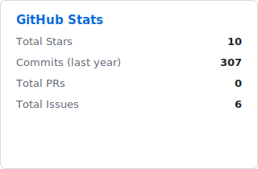
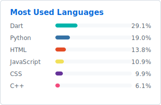

<h1 align="center">Berat Kaya</h1>

<b>R&D Engineer & Software Developer</b>

  
  
  
  
  
  
  
  
  

---

I'm a Software Engineering graduate currently working as an R&D Engineer and Software Developer. I began as a candidate engineer during my final year of university, later transitioning into this role after graduation.

My work centers on building the software layer for embedded and hardware-integrated systems — Flutter and Python mobile and desktop applications that communicate with physical devices over Bluetooth, network protocols, and serial communication, including battery management system monitors, variable message sign controllers, LED displays, and Arduino-driven display systems.

I'm comfortable working across the stack — from firmware-adjacent protocol debugging to application-level design — and I actively use AI tooling to accelerate development and pick up unfamiliar technologies quickly.

---

  
  

<table align="center">
  <tr>
    <td>You are visitor</td>
    <td></td>
  </tr>
</table>
